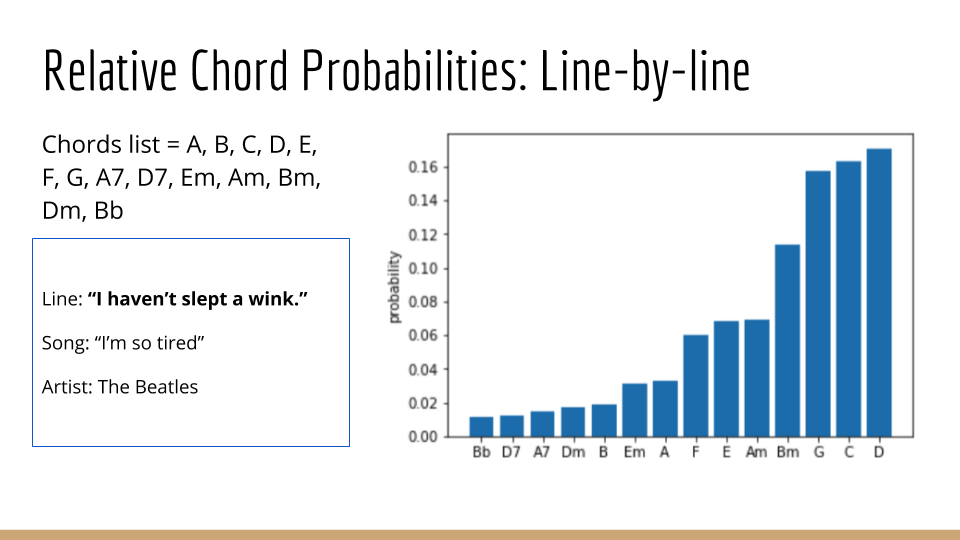

# Chordify

## Chord predictions based on user lyrics

### Motivation

For much of rock, pop, folk, and other types of music, the key and the chord choices throughout out the song serve to amplify the message coming out of the lyrics. As a musician and aspiring song writer, I've had trouble composing music after writing lyrics.

Chordify addresses this issue for beginning songwriters!

### Product

Chordify is a user interface that allows songwriters to input English words and receive suggested chords based on those words to use as the songwriter begins to compose a song. The chord suggestions reflect a preponderance of word-chord associations represented in the 8,000-song sample set.  A user can receive chord recommendations for a long piece of text or line-by-line recommendations for chord changes. The chords will inspire the songwriter and provide a foundation upon which a custom song can be composed.  

Chordify is a user interface that allows songwriters to input English words and receive suggested chords based on those words to use as the songwriter begins to compose a song. The chord suggestions reflect a preponderance of word-chord associations represented in the 8,000-song sample set.  A user can receive chord recommendations for a long piece of text or line-by-line recommendations for chord changes. The chords will inspire the songwriter and provide a foundation upon which a custom song can be composed.

### Data scraping and parsing

8,000 songs were scraped from https://www.ultimate-guitar.com/ and parsed into separate lines of words and chords, with each chord matched to the word it landed on via character indexing. From there, I pulled out the 10 words that surrounded the chord (seven before and three after) and made chord-word association for each of those 10 words.  

### Modeling

My model was based in Tf-Idf vectorization and Logistic Regression. The training dataframe included a row for each of the 10-word phrases I had pulled from the songs. The targets were boolean-columns for each of the 14 chords I chose to include, indicating whether that was the chord change associated with the phrase.

From there, I built a dictionary of 14 models - one for each of the chords. They each were transformed with Tf-Idf and fit with Logistic Regression.

For predictions, user-inputted words are transformed by the Tf-Idf vectorization and then a Logistic Regression predict_proba was ran for each of the models in the chord model dictionary. Chordify's chord prediction was the that which had the highest probability.

Example of relative probabilities for one line of text:



### Access the project

After cloning the repo, the following commands can be run in iPython:

###### Import the application

```import LogisticChordAnalyzer```

###### Run the main block

```LogisticChordAnalyzer.main()```

###### You will then be asked to enter words. No minimum or maximum number. Separate phrases with punctuation to (.,!?) to get separate  chord suggestion for different phrases.
